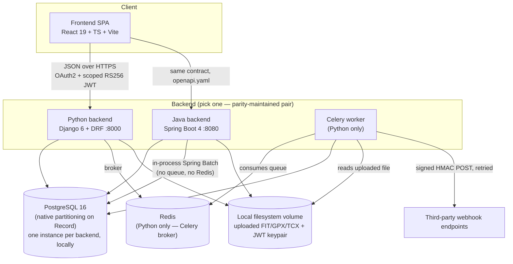
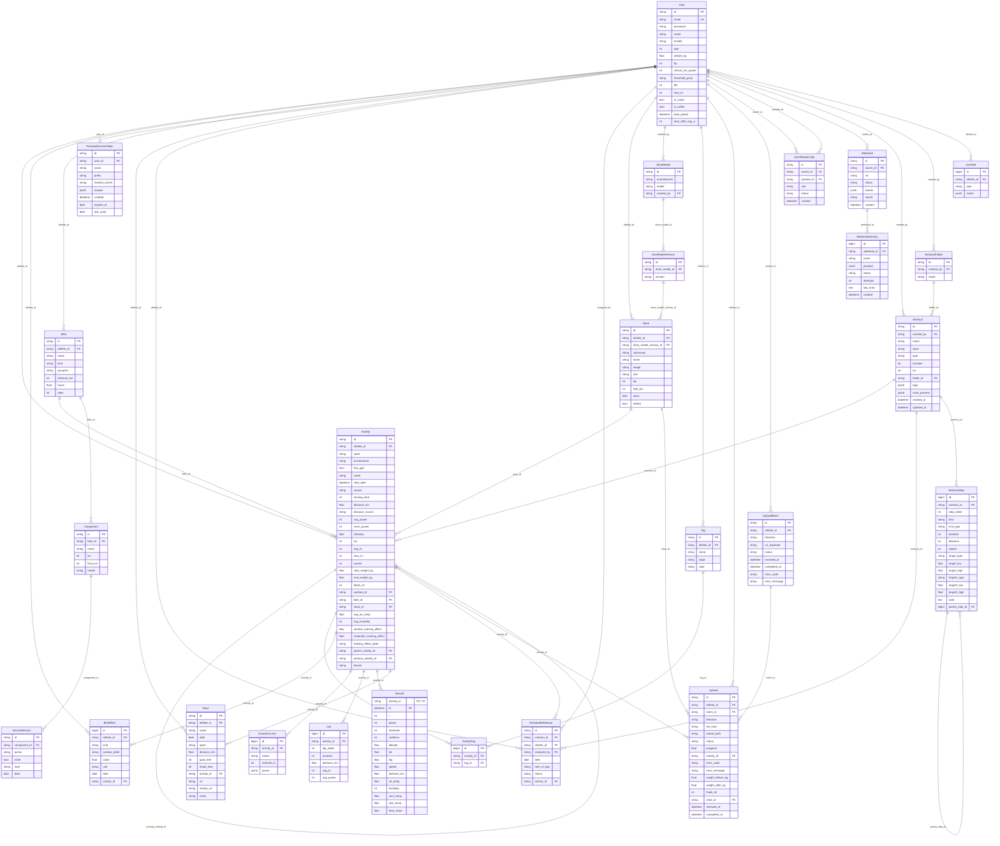
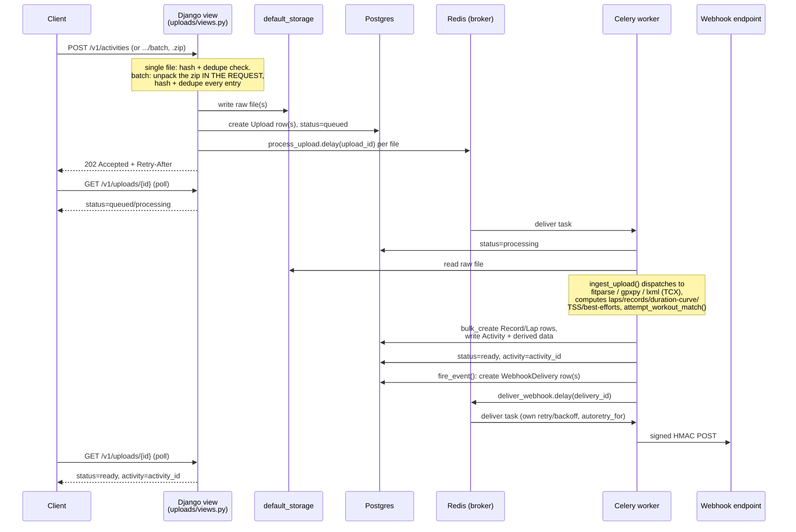
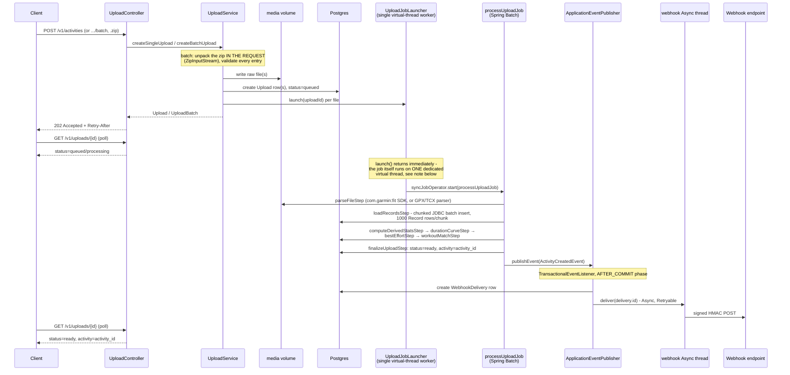

# Architecture

This documents how Cadence is actually built today — not the intended
target state (see the design `.dc.html` files and `README.md` for that),
and not where it's going in AWS (see `AWS_MIGRATION_PLAN.md` for that). It's
the reference for "how does this system actually work right now," grounded
directly in the code.

## 1. Shape of the system

Two backend implementations are maintained in **strict feature/schema
parity** against a single shared contract (`openapi.yaml`, 71 operations;
drift tracked in `SCHEMA_COMPARISON.md`). They are not a primary/fallback
pair — either can serve the same frontend unmodified, pointed at by
`VITE_API_BASE_URL`. New features land Python-first in practice, then get
ported to Java (observable from git history), but both are expected to be
fully working REST APIs against the same data model.

## 2. Domain model

Both backends implement the same entities (Python: Django ORM models,
one `models.py` per app; Java: JPA `@Entity` classes under
`com.cadence.api.*`). 27 Django migrations / 31 Flyway migrations — the
counts differ because Flyway's migration granularity doesn't map 1:1 to
Django's, not because the schemas have diverged.

| Domain | Entities | Notes |
|---|---|---|
| **Identity & access** | `User`, `UserRelationship`, `PersonalAccessToken` | `UserRelationship` (owner → grantee, `role: viewer\|coach`, `status: pending\|active`) is the single mechanism behind both "share my data with a viewer" and "let this coach manage me" — same table, no separate coaching-specific schema. |
| **Activities** | `Activity`, `Lap`, `Record` (1Hz stream, natively RANGE-partitioned on `ts`), `DurationCurve`, `BestEffort`, `Tag`/`ActivityTag` | The one table in the system that's partitioned — see `AWS_MIGRATION_PLAN.md` §4 for why (previously a TimescaleDB hypertable, moved to native partitioning once TimescaleDB was confirmed unsupported on AWS RDS/Aurora). |
| **Athletes** | `ZoneSet` | HR/power/pace zone definitions, computed from profile thresholds (FTP, LTHR, threshold pace, etc.). |
| **Workouts** | `Workout`, `WorkoutFolder`, `WorkoutStep` | `WorkoutStep` is a tree: leaf steps carry `target_low`/`target_high` as ramp *start*/*end* values (not min/max), plus `repeat` groups that nest. |
| **Scheduling** | `ScheduledWorkout` | Links a `Workout` to a calendar date/assignee; resolves to `activity_id` once the planned session is actually completed (auto-matched via lap-structure inference, or manually). |
| **Gear** | `Bike`, `Component`, `ServiceRecord`, `Shoe`, `ShoeModel`, `ShoeModelVersion` | Shoe catalog is two-tier (`ShoeModel` → `ShoeModelVersion`) so mileage tracking can be per-specific-version while the catalog picker browses by model. |
| **Uploads** | `Upload`, `UploadBatch` | Tracks async ingestion job status (`queued\|processing\|ready\|failed\|duplicate\|skipped`); `stored_path` points at the raw file on `default_storage`. |
| **Webhooks** | `Webhook`, `WebhookDelivery` | Outbound-only today — no inbound webhook receivers from Garmin/Strava; import is user-initiated file upload, not a push integration. |
| **Races** | `Race` | Goal races with target time, surfaced on the dashboard's "next race" card. |

**ID scheme**: every API-addressable resource uses a Stripe-style prefixed
random ID (`act_`, `wkt_`, `usr_`, `bik_`, etc. — `PrefixedIDModel` in
Python's `core/models.py`, the equivalent `common/id` package in Java), a
14-character random suffix over `[a-z0-9]`. Entities that are never fetched
directly by ID (`Record`, `Lap`, `BestEffort`, `DurationCurve`,
`WorkoutStep`, zone rows) use a plain auto-increment integer PK instead —
deliberately not every table pays for a prefixed ID.

### 2.1 Full schema

Introspected directly from a running instance (26 domain tables, every
column and foreign key), not reconstructed from the ORM model files —
this is what's actually on disk today. Entity names below are the logical/
domain names used throughout this doc; **physical table names differ per
backend** (Django prefixes with the app label — `activities_activity`,
`accounts_user`, `gear_shoemodelversion`, etc. — while the Java schema
uses bare singular snake_case — `activity`, `users`, `shoe_model_version`).
Same columns, same relationships, same constraints; different names on
disk. Each backend also owns its own **framework-managed auth-storage
tables**, intentionally excluded below since they're not app domain data:
Django's `oauth2_provider_*` (access/refresh tokens, grants, applications)
plus Django's own `auth_*`/`django_*` tables, versus Java's single
`oauth_authorization` table (Spring's OAuth2 Authorization Server schema)
plus Spring Batch's `batch_*` job-tracking tables and Flyway's
`flyway_schema_history`.

A few things in this schema that aren't self-explanatory from the diagram
alone:

- **`Record` has no surrogate `id`** — its primary key is the composite
  `(activity_id, ts)`, and it's the one natively partitioned table in the
  system (RANGE-partitioned on `ts`, monthly partitions plus a `DEFAULT`
  catch-all — see `backend_java/src/main/resources/db/migration/
  V10__records.sql`+`V11__record_partitions.sql` or the equivalent Django
  migration `0003_record_native_partitioning.py`). Every other table is a
  normal (non-partitioned) Postgres table. Previously a TimescaleDB
  hypertable — moved to native partitioning once TimescaleDB was confirmed
  unsupported on AWS RDS/Aurora; see `AWS_MIGRATION_PLAN.md` §4.
- **`Activity` has two different self-referential FKs, and they're
  mutually exclusive by application-level validation** (not a DB
  constraint): `parent_activity_id` links a multisport/transition leg to
  its parent session (`sport in ("multisport", "transition")`);
  `primary_activity_id` links a duplicate upload to the activity it's a
  duplicate of. The API explicitly rejects linking a multisport session as
  a duplicate, and rejects a duplicate-of-a-duplicate chain (`views.py`'s
  merge-duplicate validation) — the schema itself would happily allow
  either, so this is enforced in application code, not by a check
  constraint.
- **`WorkoutStep.parent_step_id`** is how `repeat` groups nest — a step
  with `kind="repeat"` is a container whose children point back at it via
  this column; the tree is walked in application code (§6), not via a
  recursive SQL query anywhere in either backend.
- **`Shoe` is two hops from its catalog data**: `Shoe` (an athlete's owned
  pair) → `ShoeModelVersion` (a specific version/colourway) →
  `ShoeModel` (manufacturer + model name) — mileage/retirement tracking
  lives on `Shoe` itself, the catalog tables are just reference data
  shared across athletes.
- **Nullable FKs are the norm, not the exception**, here — `workout_id`,
  `bike_id`, `shoe_id` on `Activity`; `assigned_by`, `activity_id` on
  `ScheduledWorkout`; `batch_id`, `activity_id`, `shoe_id` on `Upload`; etc.
  are all optional links, reflecting that most of this data starts
  disconnected (an uploaded activity has no matched workout until
  auto-matching or a manual link happens) rather than being created
  pre-linked.

## 3. Authentication & authorization

Three credential types are accepted on the same API surface, distinguished
by prefix/shape rather than a separate endpoint per type
(`core/authentication.py` in Python; the equivalent chain in Java's
`security/SecurityConfig.java`):

1. **OAuth2 access tokens** (`django-oauth-toolkit` / Spring's OAuth2
   Authorization Server) — opaque `cad_at_...` strings, minted via
   `POST /oauth/token`. Used by the first-party frontend.
2. **Cadence-issued delegated JWTs** — RS256, signed with a locally-managed
   RSA keypair (`JWT_PRIVATE_KEY_PATH`/`JWT_PUBLIC_KEY_PATH`), minted via
   `POST /v1/auth/jwt`. These carry `sub` (the signed-in principal) and,
   separately, `athlete_id` — letting a coach's token act *as* an athlete
   they've been granted access to without re-authenticating as that
   athlete. `core/auth_context.py`'s `get_effective_athlete_id()` is the
   single place that resolves "who is this request actually acting on
   behalf of," and every view that touches athlete-scoped data calls
   through it rather than trusting `request.user` directly.
3. **Personal access tokens** — opaque `cad_pat_...` strings (own prefix,
   own `PersonalAccessTokenAuthentication` class), created/rotated/revoked
   from Preferences → API tokens, hashed at rest (`hmac.compare_digest`
   against a stored hash, not the raw secret), scoped and optionally
   expiring, `last_used` updated at most once/day per token (avoids a
   write on every single API call).

**Authorization** is a flat two-function model on top of that
(`core/permissions.py`): `user_may_read(sub, athlete_id)` — true if
`sub == athlete_id` or an **active** `UserRelationship` grants it — and
`user_may_write`, which additionally requires `role == coach` (a `viewer`
relationship is read-only). Every athlete-scoped view checks one of these
explicitly; there's no ORM-level row-security layer doing this implicitly,
so a missing check is a real, visible bug class rather than something a
framework silently prevents — worth keeping in mind when adding new
endpoints.

JWKS is served for the RS256 public key so token verification doesn't
require sharing the private key; `JWT_KID` exists specifically to support
overlapping keys during a future rotation without a schema change (see
`AWS_MIGRATION_PLAN.md` §6).

## 4. Query language (CQL)

`/v1/activities` supports a JQL/CQL-style search string (`runs tagged race
and distance > 10km ordered by tss`) — this is a **hand-rolled parser
implemented independently in both backends**, not a third-party library:
Python's `core/cql/` (tokenizer → parser → compiler-to-ORM-queryset, ~700
lines) and Java's `com.cadence.api.cql` (tokenizer → parser → grammar →
field registry, compiling to a JPA `Specification`). Because it's
hand-written twice, it's one of the highest-risk places for the two
backends to silently diverge in accepted grammar or field semantics —
worth prioritizing in any future parity audit, and a natural candidate for
a shared cross-backend test fixture (a list of query strings + expected
matches, run against both).

## 5. Upload / ingestion pipeline

Both backends accept the same inputs (single file or bulk `.zip`, `.fit` /
`.gpx` / `.tcx`) through the same async job shape (`Upload`/`UploadBatch`
rows, client polls `GET /v1/uploads/{id}` with `Retry-After` hints — see
`AWS_MIGRATION_PLAN.md` §5 for why this shape matters for a Lambda move),
compute the same derived data (laps, 1Hz records, duration curves, TSS,
best efforts, workout auto-match), and fire the same webhook events on
completion — but the two implementations are genuinely different
architectures underneath, not just a syntax translation of each other.

### 5.1 Python: Celery + Redis

Zip unpacking happens **synchronously inside the request** — the entire
archive is opened, every entry hashed and dedupe-checked, and every file
written to storage before the view returns — only the actual per-file
parse-and-compute work is deferred to Celery. A batch's individual
failures don't fail the batch: Garmin account exports mix in metadata-only
stub FITs with no real activity data, so those are marked `skipped` rather
than `failed` (see the comment in `uploads/tasks.py::process_upload`),
letting a large export finish instead of erroring out on the first stub
file. Webhook delivery retry (`deliver_webhook`) is Celery's own
`autoretry_for`/`retry_backoff`, running on the same worker pool as
ingestion — a slow/hanging webhook endpoint competes with FIT parsing for
worker capacity, since both are just tasks on the same queue.

### 5.2 Java: in-process, no queue

`processUploadJob` is seven Spring Batch steps
(`UploadJobConfig.java`): `parseFileStep` → `loadRecordsStep` (the one
chunked step — everything else is a single tasklet) →
`computeDerivedStatsStep` → `durationCurveStep` → `bestEffortStep` →
`workoutMatchStep` → `finalizeUploadStep`, with an explicit
`NO_ACTIVITY_DATA` exit routed straight to a clean `COMPLETED` end (the
same Garmin-stub-file case Python handles via `status=skipped`) kept
separate from the `FAILED` transition so a genuinely corrupt file doesn't
get misrouted through the rest of the job.

**Correction to a common assumption about this pipeline** (and to how an
earlier version of this document described it): "in-process with virtual
threads" does *not* mean concurrent ingestion. `UploadJobLauncher` runs
every job on a **single dedicated virtual thread**
(`Executors.newSingleThreadExecutor`), deliberately serialized. This has
been investigated twice now, not just carried forward as an assumption:

- **First finding** (original design): `@JobScope`/`@StepScope` beans
  (e.g. `UploadJobContext`) resolved per-execution via Spring Batch's
  thread-local `JobSynchronizationManager` were verified **not** safely
  isolated across genuinely concurrent `Job.execute()` calls — concurrent
  uploads produced cross-contaminated `Record` rows and dropped/duplicate
  launches.
- **Second finding** (a later attempt to fix the above and re-enable real
  concurrency): replacing that scoping with an explicit thread-safe
  registry (`UploadJobContextRegistry`, keyed by `uploadId`) removed the
  first issue, and a related gap was found and fixed alongside it —
  `BatchConfig`'s `syncJobOperator` had been constructing
  `TaskExecutorJobOperator` manually, skipping the transactional proxy
  Spring Batch's own docs say `JobOperatorFactoryBean` exists specifically
  to provide for safe concurrent `start()` calls. **Both fixes are real
  and are kept** — but `UploadConcurrencyIntegrationTest` (fires many
  uploads at genuinely the same moment, checks every one lands
  uncontaminated data) still fails with concurrency raised above 1 even
  with both fixes in place: `JobParameters` intermittently get
  cross-assigned between concurrent `start()` calls, a different specific
  symptom each run — consistent with a genuine race still present
  somewhere in this exact Spring Batch 6.0.4 release's `JobRepository`/
  `JobExplorer` internals, not yet root-caused with confidence. Forcing
  concurrency through against a real failing regression test would be
  irresponsible, so ingestion **stays serialized** — now provably safe at
  that concurrency by the same test, rather than safe-by-assumption.

So a Java batch import of N files still processes them **one at a time**,
not N-wide in parallel — virtual threads here buy cheap, non-blocking
hand-off from the HTTP request thread (`launch()` returns immediately),
not throughput. This is the concrete mechanism behind the batch-import
contention concern already flagged in `AWS_MIGRATION_PLAN.md` §5.4/§10: a
large Garmin export genuinely runs its files sequentially on the same
task, so splitting ingestion onto its own ECS service buys you *more
parallel single-worker queues* (one per task), not a fix to the per-task
seriality itself.

Webhook delivery uses Spring's own async/retry machinery — `@Async`
(delivery runs on Spring's task executor thread pool, not the ingestion
job's thread) + `@Retryable` — functionally equivalent to Celery's
`autoretry_for`/`retry_backoff` on the Python side, but in-process rather
than broker-dispatched, consistent with Java having no queue anywhere in
this pipeline.

### 5.3 Side by side

| | Python | Java |
|---|---|---|
| Dispatch | Celery task via Redis broker | Single-worker virtual-thread executor, in-process |
| Parse libraries | `fitparse`, `gpxpy`, `lxml` (TCX) | `com.garmin:fit` (official SDK), own GPX/TCX parsers |
| Bulk `Record` insert | Django `bulk_create()` | `JdbcBatchItemWriter`, 1000-row chunks |
| Concurrency across files in one batch | One Celery task per file — as concurrent as the worker pool/replica count allows | Strictly serial — one file at a time, by design (see above) |
| Webhook delivery | Celery task, own retry/backoff, same worker pool as ingestion | `@Async` + `@Retryable`, separate thread pool from ingestion |
| Failure isolation (Garmin stub files) | `status=skipped`, batch continues | `NO_ACTIVITY_DATA` exit → clean `COMPLETED`, batch continues |

### 5.4 Best-effort computation

`BestEffort` rows (max power/HR over fixed durations, best pace over fixed
distances) are computed by the same algorithm on both backends — Python in
`backend/uploads/processing.py`, Java in `BestEffortComputeService` /
`PaceBestEffortCalculator` / `DurationCurveCalculator`.

**Trigger.** Runs once per ingested activity, immediately after its `Record`
rows are persisted, from `ingest_upload()` — but *not* for a multisport
parent activity (its legs run it individually, since best efforts compare
like-for-like within a single sport). The identical per-activity logic also
runs during a full recompute (`POST /v1/athletes/{id}/best-efforts/recompute`,
streamed as SSE progress events), which first deletes every existing row for
the athlete (optionally scoped to one `kind`) and then replays every activity
oldest-to-newest through the same code path — order doesn't affect the final
result, since trim (below) re-derives the keeper set from whatever rows exist
in the database at that moment, not from an in-memory running comparison.

**Gating — which kinds get computed at all.** A kind is skipped entirely,
for every activity, until the athlete has the relevant threshold set:

| kind | requires |
|---|---|
| `cycling_power` | sport is bike, and `athlete.ftp` is set |
| `cycling_hr` | sport is bike, and the activity has any HR samples |
| `running_power` | sport is run, `athlete.critical_run_power` is set, and at least one non-null power sample |
| `running_pace` | sport is run — no threshold gate |
| `running_hr` | sport is run, and the activity has any HR samples |

**Two different scan algorithms**, depending on whether the window is a
fixed *duration* or a fixed *distance*:

- **Power/HR — fixed-duration sliding window.** Null samples are zero-filled
  first, then a running-sum slide finds the highest average over a fixed
  *index* count matching the window's label (`5s`→5 elements ... `60min`→3600),
  which implicitly assumes ~1 Hz sampling. Windows checked — power:
  `5s, 15s, 30s, 1min, 5min, 10min, 20min, 60min`; HR:
  `1min, 5min, 10min, 20min, 60min`.
- **Pace — fixed-distance, variable-time two-pointer.** Null distance samples
  are forward-filled (a gap means "no new distance yet," not "reset to
  zero"). For each target distance (`1km, 5km, 10km, half_marathon, 30km,
  marathon, 50km`), a two-pointer scan finds the shortest real-elapsed-time
  span — using each sample's actual elapsed-seconds offset, not the sample
  *index* gap, so devices with adaptive/non-1 Hz recording aren't
  mismeasured — covering at least that distance, keeping the fastest pace
  found anywhere in the activity.

**Upsert.** Every window that produced a value gets one row, keyed on
`(athlete, kind, window, activity)` — `update_or_create`/JPA upsert, so
reprocessing an activity updates its own row rather than duplicating.

**Retention (trim).** Immediately after each upsert, trim re-derives the
full keeper set for that `(athlete, kind, window)` from every row currently
stored: the athlete's top N (`best_effort_top_n`, default 10) all-time by
value, **unioned with** the top N within each of several rolling day-cutoffs
— `28, 90, 112, 365` (`BEST_EFFORT_TRIM_PERIOD_DAYS` in Python,
`BestEffortWindows.TRIM_PERIOD_DAYS` in Java), measured from wall-clock
today, not the activity's own date. Anything outside that union is
**deleted**, not hidden (`_trim_kind_window` / `trimToTop`). A row surviving
trim is therefore "a top-N record in at least one tracked period," not
necessarily an all-time record — storage is still bounded, just to
`top_n * (periods + 1)` rows per window instead of a single top N. Trim only
runs when a row is upserted; a row isn't proactively deleted the instant it
ages out of a period between uploads, only at the next trim call for that
window.

**Reading it back.** `GET /v1/athletes/{id}/best-efforts?kind=&period=`
supports native period cutoffs `4w, 3m, 16w, 1y, all` (`4w`/`16w` match the
trim cutoffs exactly, so the Best Efforts screen's tabs query precisely the
window they display rather than over-fetching a wider bucket and narrowing
client-side — an earlier version of this endpoint did the latter, which
could silently drop entries that were genuinely top-N within the narrower
window but not within the top-N of the wider bucket they were fetched from).
Because trim retains a *union* across periods, a single date-filtered read
can still see more than top-N survivors for one window (e.g. two disjoint
period-slices' keepers both falling inside the query range) — so the read
endpoint re-groups by window and re-caps to the true top N by value
(respecting pace's lower-is-better direction) before returning
(`_cap_per_window` in Python, `capPerWindow` in Java's
`BestEffortController`).

**Known quirks.**
- Power/HR windowing assumes roughly-uniform (~1 Hz) sampling (index-based);
  pace deliberately doesn't (time-based) — an asymmetry that exists because
  only the pace algorithm's sparse-recording bug has been found/fixed so far.
- `running_pace` runs for every run regardless of profile completeness; the
  power/HR kinds silently produce nothing until the relevant threshold field
  is set on the athlete.
- Multisport parent activities never get their own best-effort rows.

## 6. Workout subsystem

`WorkoutStep` is a tree — leaf steps (duration + a target: power/HR/pace/
open, `target_low`/`target_high` as ramp *start*/*end*, not min/max) and
`repeat` groups that can nest. Both backends consume/produce this same
tree shape for:

- **The Builder UI** (frontend `WorkoutDesignerScreen`) — hand-authored
  workouts, templates, nested repeat groups.
- **Export** — Zwift `.zwo` and Garmin `.tcx` generation from the tree.
- **Inference from a completed activity's laps** (`workouts/inference.py`
  in Python, `WorkoutInferenceService` in Java) — converts `Lap` rows into
  a leaf-step tree (target inferred from `avg_power`/`avg_hr` against the
  athlete's live zone reference) plus a greedy contiguous-repeat-block
  detector with fuzzy tolerance (duration ±~15%/10s, %FTP ±~5pts) that
  collapses repeated patterns into `repeat` groups, re-run to a fixed point
  so nested patterns (e.g. `2×[4×(work,rest), rest]`) fall out without a
  separate nesting code path. Read-only/idempotent (`GET
  /v1/activities/{id}/infer-workout`) — nothing is persisted until the
  athlete explicitly saves the inferred draft from the Builder.

## 7. Webhooks

Outbound only: an athlete/coach registers a `Webhook` (URL + subscribed
event list + secret), and `fire_event()` (`webhooks/events.py`) fans out a
`WebhookDelivery` to every active subscription whose owner can read the
affected athlete's data, then enqueues delivery. Delivery
(`webhooks/tasks.py::deliver_webhook`) POSTs a signed payload
(`X-Cadence-Signature`: HMAC-SHA256 over the raw body) with automatic
retry/backoff (`autoretry_for`, exponential, capped at 600s, 6 total
attempts). `fire_event()` deliberately swallows any exception from
enqueueing — a broken webhook subscriber must never be able to fail the
upload or scheduling action that triggered it.

## 8. Frontend

React 19 + TypeScript SPA (Vite, no server-side component — `npm run
build` produces a static `dist/`). Key structural choices:

- **Server state**: `@tanstack/react-query` throughout — no separate
  client-side store; cache keys double as the invalidation mechanism
  (e.g. `["activity", id]` shared between the activity detail screen and
  every `ActivityName` lookup elsewhere).
- **API layer** (`api/client.ts`): a single `apiFetch<T>()` wraps
  `fetch()`, injects the bearer token, and — on a `401` — calls a
  `refreshHandler` (registered by `AuthContext`) and retries once with the
  new token. `AuthContext` dedupes concurrent refresh calls behind an
  in-flight `Promise` (`useRef`), since two callers racing the same
  single-use/rotating refresh token would otherwise have the loser
  `logout()` the session — a real bug this pattern was added to fix, not
  speculative hardening.
- **Charts**: D3 (`d3-scale`/`d3-shape`/`d3-array`) for scale/shape math
  only, rendered as JSX `<path>`/`<rect>`/SVG — never `d3.select()`
  mutating DOM nodes React owns. Workout ramp visualization
  (`WorkoutChart.tsx`) renders `<polygon>` trapezoids per leaf step so
  ramps show actual slope, not flat blocks.
- **Maps**: `maplibre-gl` (vector tiles, Carto's free basemap styles, no
  API key) for the route map on the Activity Analysis screen; indoor
  activities (`has_gps=false`) get a distance-source panel instead.
- **Routing**: `react-router-dom`, one route per top-level screen
  (`/`, `/activities`, `/activities/:id`, `/best-efforts`, `/calendar`,
  `/gear`, `/import`, `/workouts`, `/preferences`), gated behind
  `RequireAuth`.
- **Theming**: three token-driven CSS-custom-property themes (Teal /
  Violet / Day), switched via a `data-theme` attribute, no per-component
  styling forks.

## 9. Testing

- **Python**: `pytest` with a `unit`/`integration` marker split
  (`pytest -m unit` needs no external services; `-m integration` needs
  Postgres) — mirrors how CI splits the two jobs. `factory-boy` for model
  fixtures. `workouts/test_roundtrip.py` round-trips both generated random
  workouts and real fixture files (`test_fixtures/roundtrip/*.json`)
  through the inference engine to catch heuristic regressions.
- **Java**: JUnit 5, with the same `unit`/`integration` split expressed as
  Gradle tasks (`unitTest` excludes `@Tag("integration")`; `integrationTest`
  boots a real Postgres via Testcontainers against the same
  `docker-compose`-provisioned Docker daemon used locally). Spring Batch's
  own test harness (`spring-batch-test`) exercises the ingestion job
  directly.
- **Frontend**: `vitest` (unit), `eslint` (including React-Compiler-aware
  rules — `react-hooks/set-state-in-effect`, `react-hooks/immutability` —
  that have caught real bugs during development, not just style nits),
  `tsc -b`, all required as separate CI steps, not bundled into one script.

## 10. CI

GitHub Actions, one workflow per concern (`.github/workflows/`):
`tests.yml` (Python unit + integration), `java-tests.yml` (Java unit +
integration), `lint.yml` (ruff check + format), `frontend.yml` (tsc, eslint,
vitest, build), `codeql.yml` (Python/Java/TS static analysis, scheduled
weekly plus every push/PR). Backend-specific workflows are **required
status checks on every PR regardless of whether that PR touches the
backend** — a step-level `dorny/paths-filter` no-ops the actual work on
unrelated PRs instead of using a workflow-level `paths:` trigger filter,
because GitHub leaves a `paths:`-gated required check permanently
"Expected — waiting for status to be reported" on PRs that don't touch the
matching files.

## 11. Local development

Two fully independent Docker Compose stacks (deliberately offset ports so
both can run simultaneously — Python on 8000/5432/6379, Java on
8080/5433):

- **Python** (`docker-compose.yml` + `docker-compose.dev.yml`): `db`
  (plain PostgreSQL 16), `redis`, `backend` (gunicorn in prod-shape /
  `runserver` in dev), `celery-worker` (runs with `-B`, embedding the beat
  scheduler for the one periodic task, `ensure_record_partitions` — see
  §4's schema note; no separate beat service, not warranted for one task).
  `entrypoint.sh` generates the JWT keypair on first boot (idempotent —
  skips if the key file already exists), runs migrations, then writes a
  `.ready` sentinel file that `celery-worker`'s entrypoint blocks on before
  starting, so the worker never runs against an unmigrated schema.
- **Java** (`backend_java/docker-compose.yml`): `db` (plain PostgreSQL 16,
  own instance — `cadence_java`, not shared with Python), `backend` only —
  no worker service, consistent with §5's in-process ingestion model
  (`PartitionMaintenanceService`'s `@Scheduled` task runs in-process inside
  `backend` too, same reasoning).

Both mount `jwt_keys` and `media` as named volumes, not bind mounts, in the
production-shape compose file; the dev override adds source bind-mounts
plus an anonymous volume over `.venv`/build output so the host's
(e.g. macOS) dependency install doesn't shadow the container's Linux one.

## 12. Cross-cutting things worth knowing before changing either backend

- **Parity is enforced by discipline, not tooling** — there's no automated
  contract test running the same request against both backends and diffing
  responses. `openapi.yaml` and `SCHEMA_COMPARISON.md` are the source of
  truth a human (or an agent) reconciles against; a schema or behavior
  change in one backend without the matching change in the other won't be
  caught by CI.
- **The CQL parser (§4) and the best-effort computation/trimming logic
  (§5.4) are the two most likely places for silent behavioral drift** between backends —
  both are non-trivial hand-written logic implemented twice, not thin
  wrappers around a shared library.
- **`Record` (1Hz stream data) dominates storage** by a wide margin over
  every other table combined — see `AWS_MIGRATION_PLAN.md` §11.1 for
  measured numbers from real data (~1MB of stream data per activity on
  average).
- **Migrations run at container boot** in the current local setup
  (`entrypoint.sh` / Flyway-on-startup), which is fine for a single dev
  container but becomes a race condition the moment more than one task
  starts concurrently — already flagged as a pre-AWS-migration fix in
  `AWS_MIGRATION_PLAN.md` §8.3, not yet changed in the code.
