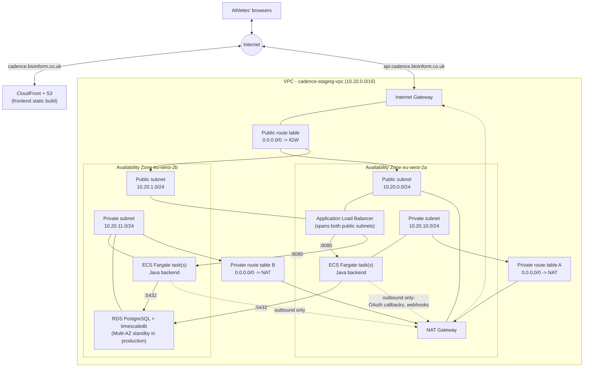

# Network architecture

## Architecture

Cadence's `staging` environment runs in a dedicated VPC rather than the AWS
account's default VPC, so its subnets, routing, and security groups stay
scoped to this application rather than shared with anything else that later
lands in the same account.

The design follows the standard AWS two-tier subnet pattern: a **public
tier** for anything that needs a direct path to the internet (the
Application Load Balancer, the NAT Gateway), and a **private tier** for
everything else (ECS tasks, RDS) — reachable from inside the VPC only, with
outbound-only internet access via the NAT Gateway for things like OAuth
provider callbacks and webhook delivery. The frontend (S3 + CloudFront) sits
outside the VPC entirely — it's a static build with no compute, so it has no
network-level dependency on it.

The following diagram shows the target network architecture for the
`staging` environment:

**Current build status** (kept in sync with `infra/README.md`'s step log):
VPC, both subnet tiers, the Internet Gateway, and a single NAT Gateway are
built (Step 2). The ALB, ECS tasks, and RDS instance shown above are the
target shape for upcoming steps — not yet provisioned.

## Traffic data flow

**Inbound, frontend** (static assets): a browser requests
`cadence.bioinform.co.uk` → resolved via Route 53 to CloudFront → CloudFront
serves the cached React build directly from S3, or fetches from S3 on a
cache miss. No VPC involvement at all.

**Inbound, API**: a browser's API call to `api.cadence.bioinform.co.uk` →
resolved via Route 53 to the ALB's public IP → the Internet Gateway routes
it (per the public route table) to the ALB in whichever public subnet is
closest → the ALB terminates TLS and forwards to a healthy ECS task on port
8080, in either private subnet, via its target group.

**Outbound, from ECS tasks**: an ECS task's own outbound calls (OAuth
authorization-code exchange with Strava/Google/Apple, outbound webhook
delivery, pulling its container image from ECR) → routed per that AZ's
private route table to the NAT Gateway → NAT'd to the NAT Gateway's public
Elastic IP → out through the Internet Gateway. Nothing on the internet can
open a connection back in this direction — only responses to a connection
the ECS task itself initiated.

**Database**: ECS tasks reach RDS on port 5432 entirely within the VPC's
private address space — this traffic never touches the Internet Gateway or
NAT Gateway at all.

## Network components

- **[Internet Gateway](https://docs.aws.amazon.com/vpc/latest/userguide/VPC_Internet_Gateway.html)**
  — the VPC's one attachment point to the internet. Only the public
  subnets' route table points at it.
- **[NAT Gateway](https://docs.aws.amazon.com/vpc/latest/userguide/vpc-nat-gateway.html)**
  — gives the private subnets outbound-only internet access. `staging` runs
  a single NAT Gateway (cost over redundancy — see `infra/README.md` Step
  2); a production environment would add one per AZ so an AZ outage doesn't
  take down every private subnet's outbound path at once.
- **Public subnets** (one per AZ) — host the Application Load Balancer and
  the NAT Gateway. Nothing else needs to live here.
- **Private subnets** (one per AZ) — host the ECS Fargate tasks and the RDS
  instance. No public IP; reachable only from inside the VPC (the ALB) or
  via the security-group rules defined when those resources are built.
- **[Application Load Balancer](https://docs.aws.amazon.com/elasticloadbalancing/latest/application/introduction.html)**
  (upcoming) — terminates TLS (ACM certificate, DNS-validated via Route 53)
  and forwards to the ECS service's target group. Spans both public
  subnets for AZ redundancy even though the backing ECS service may run a
  single task in `staging`.
- **[RDS for PostgreSQL](https://docs.aws.amazon.com/AmazonRDS/latest/UserGuide/CHAP_PostgreSQL.html)
  with the `timescaledb` extension** (upcoming) — see `AWS_MIGRATION_PLAN.md`
  §4 for why RDS + the community extension, not Timescale Cloud or
  self-managed. Placed in the private subnets, gp3 storage with autoscaling.
- **[CloudFront](https://docs.aws.amazon.com/AmazonCloudFront/latest/DeveloperGuide/Introduction.html)
  + S3** (upcoming) — serves the frontend's static build. Outside the VPC
  entirely; no compute, so no network dependency on anything above.
- **Security groups** (defined alongside each resource as it's built, not
  up front): ALB → ECS on 8080 only; ECS → RDS on 5432 only; nothing else
  has any ingress path. No component other than the ALB has a public IP.

## Design decisions not in the diagram

- **CIDR**: `10.20.0.0/16` for the VPC, chosen to stay clear of the
  account's default VPC (`172.31.0.0/16`) in case anything ever needs to
  peer the two. Each subnet is a `/24` (`10.20.0.0/24`, `10.20.1.0/24` for
  public; `10.20.10.0/24`, `10.20.11.0/24` for private — the `.10`/`.11`
  offset is purely a naming convenience to keep the two tiers visually
  distinguishable in the console, not a technical requirement).
- **Why 2 AZs even for one environment**: subnets themselves are free:
  spanning 2 AZs from the start means RDS Multi-AZ and a 2-task ECS service
  can both be turned on later without a network redesign — only the NAT
  Gateway count (§ above) is deliberately kept to a cost-vs-redundancy
  tradeoff per environment.
