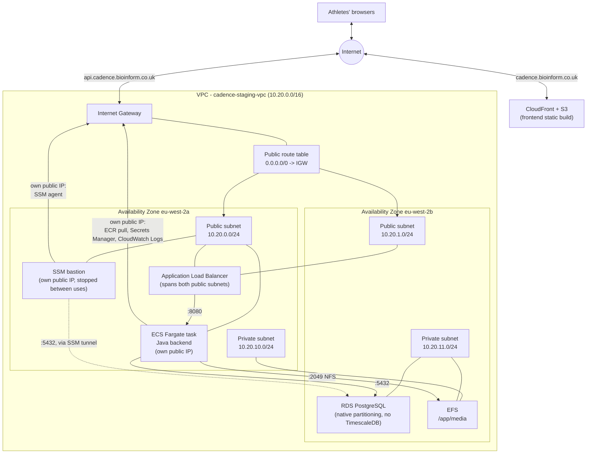

# Network architecture

## Architecture

Cadence's `staging` environment runs in a dedicated VPC rather than the AWS
account's default VPC, so its subnets, routing, and security groups stay
scoped to this application rather than shared with anything else that later
lands in the same account.

The design follows the standard AWS two-tier subnet pattern, but with no NAT
Gateway: a **public tier** for anything that needs a direct internet route -
the Application Load Balancer, the ECS Fargate task, and the SSM bastion -
and a **private tier** for RDS and EFS, neither of which ever needs outbound
internet at all, so they have no internet route in either direction. The ECS
task and bastion having public IPs doesn't mean they're reachable from the
internet - both are locked down entirely by their own security groups (ECS:
ingress only from the ALB's SG; bastion: zero ingress rules, SSM's connection
model is outbound-initiated only). See `infra/README.md`'s Step 6 for why NAT
was removed - its only two consumers (ECS, bastion) could each just get a
public IP instead, for a ~$36.50/mo saving with no security regression.
`enable_nat_gateway` on the `vpc` module is kept as a toggle (not deleted)
for a future environment that genuinely needs private-subnet-only egress.
The frontend (S3 + CloudFront) sits outside the VPC entirely - it's a static
build with no compute, so it has no network-level dependency on it.

The following diagram shows the `staging` environment as actually built:

## Traffic data flow

**Inbound, frontend** (static assets): a browser requests
`cadence.bioinform.co.uk` → resolved via Route 53 to CloudFront → CloudFront
serves the cached React build directly from S3 (Origin Access Control - the
bucket itself is fully private), or fetches from S3 on a cache miss. No VPC
involvement at all.

**Inbound, API**: a browser's API call to `api.cadence.bioinform.co.uk` →
resolved via Route 53 to the ALB → HTTP (80) redirects to HTTPS (443) → the
ALB terminates TLS (ACM cert) and forwards to the healthy ECS task on port
8080 via its target group, over the VPC's internal address space (the ALB
reaches the task's private IP directly, even though the task also has a
public one).

**Outbound, from the ECS task**: pulling its image from ECR, resolving
`POSTGRES_PASSWORD`/`JWT_PRIVATE_KEY_PEM`/etc. from Secrets Manager, shipping
logs to CloudWatch → all go out through the Internet Gateway via the task's
own public IP (no NAT Gateway - see Step 6). The task's security group still
only allows *inbound* traffic from the ALB, so this doesn't expose anything -
outbound connections the task itself initiates work regardless of whether it
has a public IP.

**Database**: the ECS task reaches RDS on port 5432, and EFS on port 2049
(NFS) for `/app/media`, entirely within the VPC's internal address space -
neither touches the Internet Gateway, regardless of which subnet either side
lives in (this is true of any two resources in the same VPC, public or
private subnet).

**Ad-hoc DB access**: the SSM bastion (stopped by default, started on
demand) - `aws ssm start-session` port-forwards a local port to RDS over an
outbound-only connection the bastion's SSM agent itself initiates. No inbound
rule, no SSH key, no VPN. See `infra/README.md`'s bastion section.

## Network components

- **[Internet Gateway](https://docs.aws.amazon.com/vpc/latest/userguide/VPC_Internet_Gateway.html)**
  — the VPC's one attachment point to the internet. Only the public
  subnets' route table points at it.
- **Public subnets** (one per AZ) — host the Application Load Balancer, the
  ECS Fargate task, and the SSM bastion. All three have security groups that
  restrict what can actually reach them; a public subnet only means "has an
  internet route."
- **Private subnets** (one per AZ) — host RDS and the EFS mount targets. No
  public IP, no internet route in either direction (NAT is off) - reachable
  only from inside the VPC, via the security-group rules defined when each
  resource was built.
- **[Application Load Balancer](https://docs.aws.amazon.com/elasticloadbalancing/latest/application/introduction.html)**
  — terminates TLS (ACM certificate, DNS-validated via Route 53) and forwards
  to the ECS service's target group. Spans both public subnets for AZ
  redundancy even though the backing ECS service runs a single task in
  `staging`.
- **[RDS for PostgreSQL](https://docs.aws.amazon.com/AmazonRDS/latest/UserGuide/CHAP_PostgreSQL.html)**
  — native declarative partitioning on `activities_record`/`record`, not
  TimescaleDB (not supported on any AWS-managed PostgreSQL - see
  `infra/README.md`'s decisions table). Placed in the private subnets, gp3
  storage with autoscaling.
- **[EFS](https://docs.aws.amazon.com/efs/latest/ug/whatisefs.html)** —
  `/app/media` for the Java backend (which has no S3 storage code - see
  `infra/README.md`'s Step 3 continued section). Private subnets, IAM-
  authorized access point.
- **[CloudFront](https://docs.aws.amazon.com/AmazonCloudFront/latest/DeveloperGuide/Introduction.html)
  + S3** — serves the frontend's static build. Outside the VPC entirely; no
  compute, so no network dependency on anything above.
- **Security groups** (defined alongside each resource as it was built, not
  up front): ALB → ECS on 8080 only; ECS → RDS on 5432 only; ECS → EFS on
  2049 only; bastion → RDS on 5432 only. Nothing else has any ingress path.

## Design decisions not in the diagram

- **CIDR**: `10.20.0.0/16` for the VPC, chosen to stay clear of the
  account's default VPC (`172.31.0.0/16`) in case anything ever needs to
  peer the two. Each subnet is a `/24` (`10.20.0.0/24`, `10.20.1.0/24` for
  public; `10.20.10.0/24`, `10.20.11.0/24` for private — the `.10`/`.11`
  offset is purely a naming convenience to keep the two tiers visually
  distinguishable in the console, not a technical requirement).
- **Why 2 AZs even for one environment**: subnets themselves are free.
  Spanning 2 AZs from the start means the ALB is automatically redundant
  (AWS provisions a node per associated subnet, no extra config), and RDS
  Multi-AZ / a multi-task ECS service can both be turned on later without a
  network redesign — those two are separate, explicit choices on top of the
  network, not something the subnet layout gives you for free.

## Re-enabling the NAT Gateway

Off by default (`enable_nat_gateway = false` on the `vpc` module) since
Step 6 - see that step in `infra/README.md` for why. If a future resource
genuinely needs private-subnet-only egress (no public IP acceptable even
with a locked-down security group):

1. In `infra/terraform/envs/<environment>/main.tf`, set
   `enable_nat_gateway = true` on the `vpc` module call (optionally with
   `single_nat_gateway = false` too, for one NAT Gateway per AZ instead of a
   shared one - see `modules/vpc/variables.tf`'s description of that
   tradeoff).
2. Move whichever resource needs it back to the private subnets (reverse of
   Step 6's `bastion`/`ecs` module changes).
3. `terraform plan` / `apply`. Expect a similar ~1-2 minute wait for the new
   NAT Gateway to reach "Available".
4. Update this file and `infra/README.md`'s decisions table once applied,
   same as every other step in this build.
