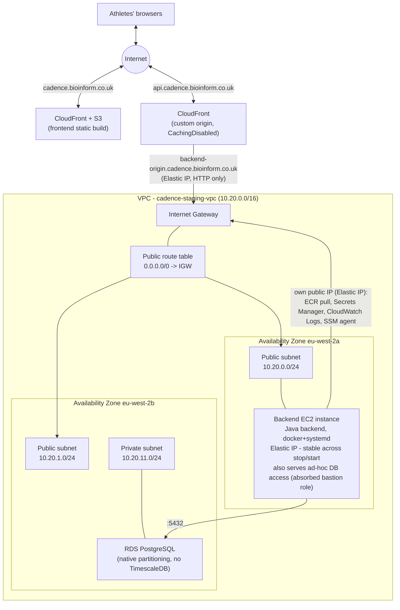

# Network architecture

## Architecture

Cadence's `staging` environment runs in a dedicated VPC rather than the AWS
account's default VPC, so its subnets, routing, and security groups stay
scoped to this application rather than shared with anything else that later
lands in the same account.

The design follows the standard AWS two-tier subnet pattern, but with no NAT
Gateway and no load balancer: a **public tier** for the one thing that needs
a direct internet route - the backend EC2 instance, which also absorbs the
old bastion's ad-hoc-DB-access role - and a **private tier** for RDS, which
never needs outbound internet at all, so it has no internet route in either
direction. The instance having a public IP doesn't mean it's reachable from
the internet - its security group only accepts traffic on port 8080 from
CloudFront's own managed IP prefix list, nothing else, and SSM's connection
model is outbound-initiated only regardless. See `infra/README.md`'s Step 6
(NAT removed) and Step 7 (ALB replaced by CloudFront-direct-to-EC2) for the
full reasoning. `enable_nat_gateway` on the `vpc` module is kept as a toggle
(not deleted) for a future environment that genuinely needs
private-subnet-only egress. The frontend (S3 + CloudFront) sits outside the
VPC entirely - it's a static build with no compute, so it has no
network-level dependency on it, and the API's CloudFront distribution
(fronting the EC2 instance) is likewise outside the VPC - CloudFront is a
managed edge service, not something that runs inside any customer VPC.

The following diagram shows the `staging` environment as actually built:

## Traffic data flow

**Inbound, frontend** (static assets): a browser requests
`cadence.bioinform.co.uk` → resolved via Route 53 to CloudFront → CloudFront
serves the cached React build directly from S3 (Origin Access Control - the
bucket itself is fully private), or fetches from S3 on a cache miss. No VPC
involvement at all.

**Inbound, API**: a browser's API call to `api.cadence.bioinform.co.uk` →
resolved via Route 53 to CloudFront → CloudFront terminates TLS (ACM cert,
us-east-1 - a CloudFront requirement regardless of where anything else
runs) and forwards to `backend-origin.cadence.bioinform.co.uk` (a plain A
record pointed at the instance's Elastic IP - set once, never touched again,
since the whole point of the EIP is that it doesn't change) over plain HTTP.
That plaintext hop is restricted to CloudFront's own edge IPs by the
instance's security group - not open to the internet - a documented,
accepted AWS pattern for exactly this shape.

**Outbound, from the backend instance**: pulling its image from ECR,
resolving `POSTGRES_PASSWORD`/JWT keys/etc. from Secrets Manager, shipping
logs to CloudWatch, the SSM agent's own connection → all go out through the
Internet Gateway via the instance's Elastic IP (no NAT Gateway - see Step
6). The instance's security group still only allows *inbound* traffic from
CloudFront on 8080, so none of this exposes anything - outbound connections
the instance itself initiates work regardless of whether it has a public IP.

**Database**: the backend instance reaches RDS on port 5432 entirely within
the VPC's internal address space - never touches the Internet Gateway,
regardless of which subnet either side lives in (true of any two resources
in the same VPC, public or private subnet). `/app/media` is a local
bind-mounted directory on the instance's own EBS volume now, not a network
filesystem - see Step 7's EFS-removal reasoning.

**Ad-hoc DB access**: same instance that serves traffic, via `aws ssm
start-session` port-forwarding over an outbound-only connection the
instance's own SSM agent initiates. No inbound rule, no SSH key, no VPN,
and no second instance to pay for - the bastion's role was absorbed here in
Step 7.

## Network components

- **[Internet Gateway](https://docs.aws.amazon.com/vpc/latest/userguide/VPC_Internet_Gateway.html)**
  — the VPC's one attachment point to the internet. Only the public
  subnets' route table points at it.
- **Public subnets** (one per AZ, only one actually used) — hosts the
  backend EC2 instance. Its security group restricts what can actually
  reach it (CloudFront's IPs only, port 8080); a public subnet only means
  "has an internet route."
- **Private subnet** — hosts RDS. No public IP, no internet route in either
  direction (NAT is off) - reachable only from inside the VPC, via the one
  security-group rule (backend instance → RDS on 5432) defined when the
  instance was built.
- **[RDS for PostgreSQL](https://docs.aws.amazon.com/AmazonRDS/latest/UserGuide/CHAP_PostgreSQL.html)**
  — native declarative partitioning on `activities_record`/`record`, not
  TimescaleDB (not supported on any AWS-managed PostgreSQL - see
  `infra/README.md`'s decisions table). Placed in the private subnet, gp3
  storage with autoscaling.
- **[CloudFront](https://docs.aws.amazon.com/AmazonCloudFront/latest/DeveloperGuide/Introduction.html)**
  — two separate distributions, both outside the VPC entirely (a managed
  edge service, not VPC-resident compute): one + S3 for the frontend's
  static build (Origin Access Control, `CachingOptimized`); one with a
  custom HTTP origin pointed at the backend instance's Elastic IP for the
  API (`CachingDisabled` + `Managed-AllViewer` - this is a thin proxy, not
  a real cache).
- **Security groups** (defined alongside each resource as it was built, not
  up front): backend instance ← CloudFront's managed prefix list on 8080
  only; RDS ← backend instance on 5432 only. Nothing else has any ingress
  path at all.

## Design decisions not in the diagram

- **CIDR**: `10.20.0.0/16` for the VPC, chosen to stay clear of the
  account's default VPC (`172.31.0.0/16`) in case anything ever needs to
  peer the two. Each subnet is a `/24` (`10.20.0.0/24`, `10.20.1.0/24` for
  public; `10.20.10.0/24`, `10.20.11.0/24` for private — the `.10`/`.11`
  offset is purely a naming convenience to keep the two tiers visually
  distinguishable in the console, not a technical requirement).
- **Still 2 AZs, even though only one is used today**: subnets themselves
  are free, and this keeps the door open for RDS Multi-AZ or a second
  backend instance later without a network redesign - separate, explicit
  choices on top of the network, not something the subnet layout gives you
  for free.

## Re-enabling the NAT Gateway

Off by default (`enable_nat_gateway = false` on the `vpc` module) since
Step 6 - see that step in `infra/README.md` for why. If a future resource
genuinely needs private-subnet-only egress (no public IP acceptable even
with a locked-down security group):

1. In `infra/terraform/envs/<environment>/main.tf`, set
   `enable_nat_gateway = true` on the `vpc` module call (optionally with
   `single_nat_gateway = false` too, for one NAT Gateway per AZ instead of a
   shared one - see `modules/vpc/variables.tf`'s description of that
   tradeoff).
2. Move whichever resource needs it back to the private subnets (reverse of
   Step 6's/Step 7's `ec2` module placement).
3. `terraform plan` / `apply`. Expect a similar ~1-2 minute wait for the new
   NAT Gateway to reach "Available".
4. Update this file and `infra/README.md`'s decisions table once applied,
   same as every other step in this build.
